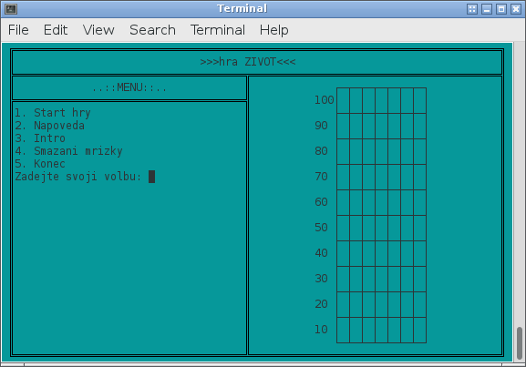
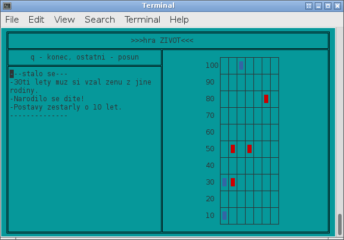

# My First Application Ever!

This is the first "serious" application I have ever done!
I programmed it probably in 2004 as a school project. Here is what
I wrote about it at that time:

> This program simulates life of one uknown family. The members of family
> can die, bear children and get married. The game is over after dead of
> the last genus of family.

I added this application mainly for myself. There is really nothing
special about it. Code is of course quite bad (yes, I used even GOTOs! ;)),
is written (as a whole app) in Czech, etc.

I was sane enough in 2004 to admit it:

> This is my first complete program and I got a lot of experiences
> when I was programming it.
>
> I know about lot of problems, but average user won’t detect them.
> The problems are in program’s structure and in code. But I believe
> I have done a good work.

But there is one thing I remember I enjoyed back then, and still now:
**This program is completely useless!**

You really just enter some initial configuration of a family and then
by hitting some key program moves to other iteration, which means
some random actions like weddings, accidents, etc. are performed.

## About

Application was written for Borland Turbo Pascal.

## How to run it now

This is probably the most interesting part of this document. How to run such
program under Linux now? I ported it under FreePascal. Compilation can be done
like this:

   fpc -MTP ZIVOT.PAS -ozivot

(There is also Makefile for that.)

Unfortunately, I used extended part of ASCII to draw console graphics, that
is not compatible with modern Unicode terminals.

I tried to port it (see branch `fpc_port`), but then I found out that 
FreePascal CRT unit
[does not support UTF-8](http://www.freepascal.org/docs-html-3.0.0/rtl/crt/index.html).

So only option is to run it in terminal with correct encoding. "The most correct"
encoding is [CP-437](https://en.wikipedia.org/wiki/Code_page_437). There is also
program called [luit](http://invisible-island.net/luit/) that should done
the conversion, but it did not work for me.

So the best option for me was to use Gnome Terminal which supports compatible
encoding `Hebrew IBM862`. Here is a tutorial how to setup it up:

http://nethack.wikia.com/wiki/IBMgraphics#gnome-terminal

## Screenshots

So, here are two screenshots of this awesome program! ;)

